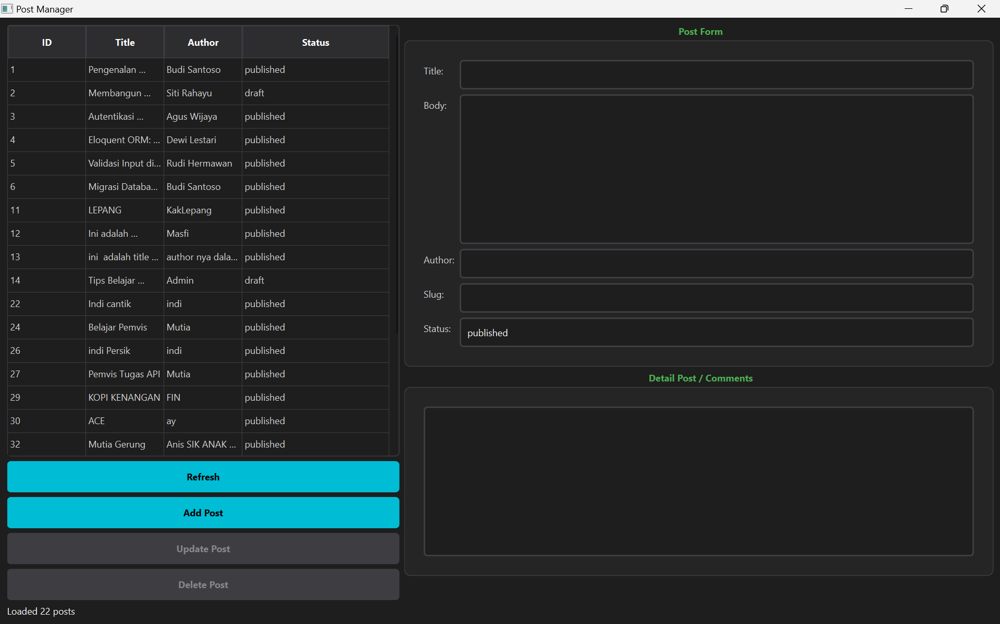
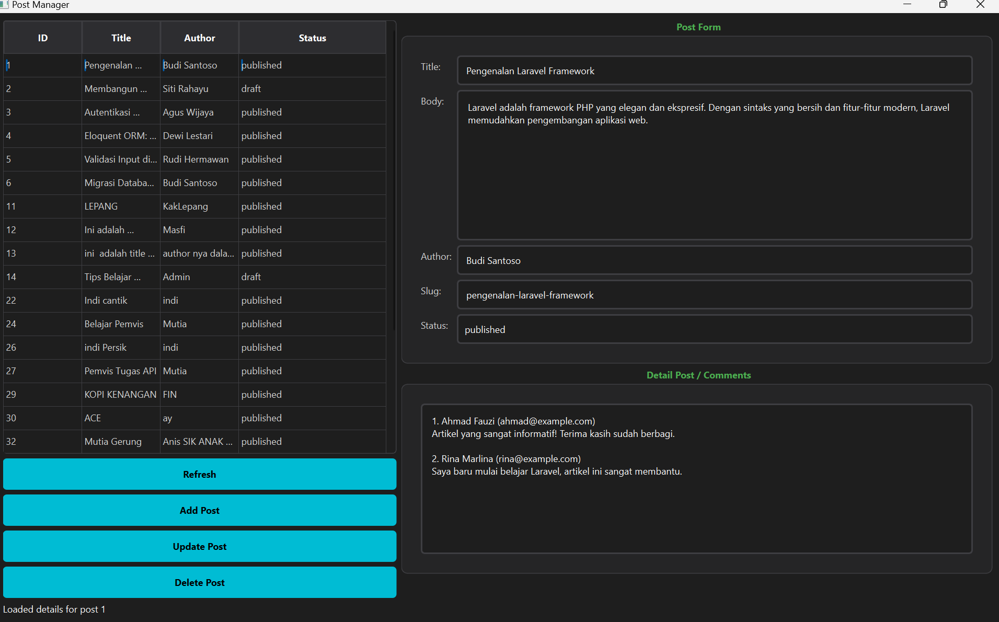
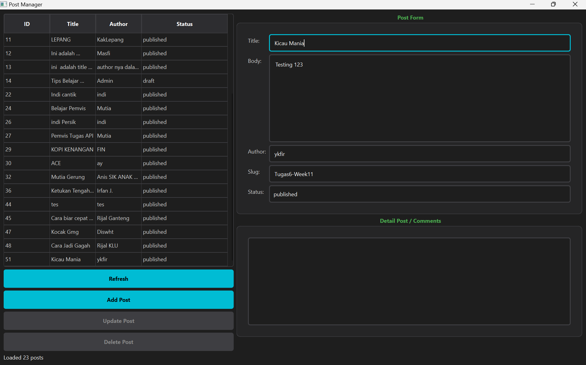
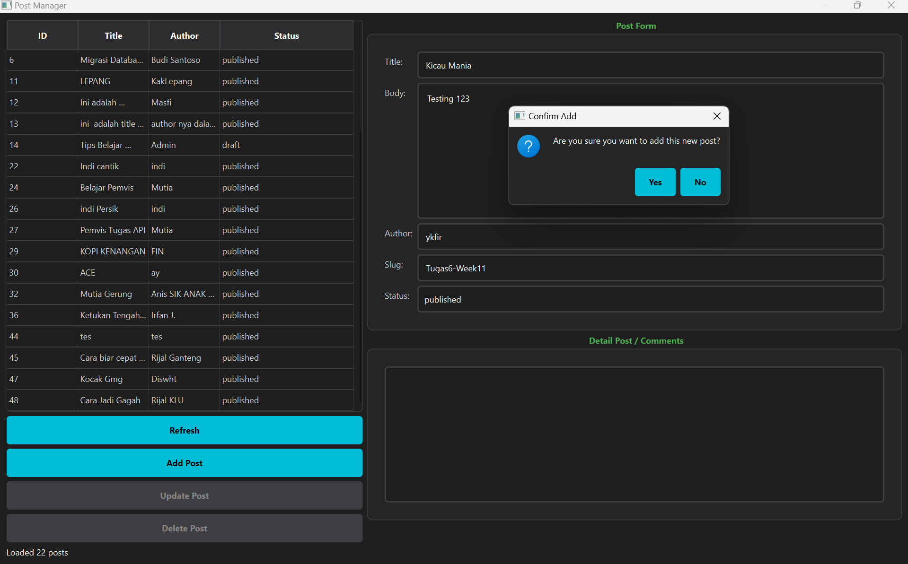
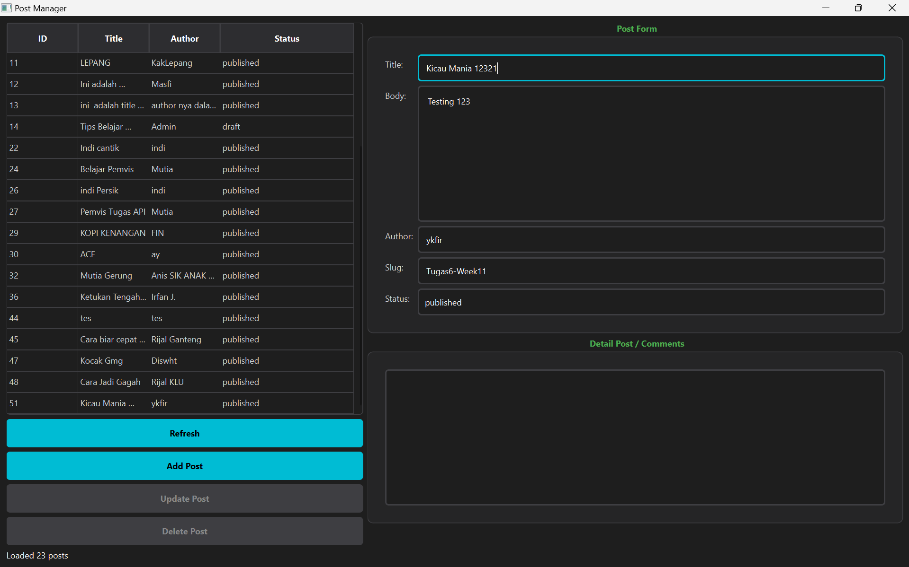
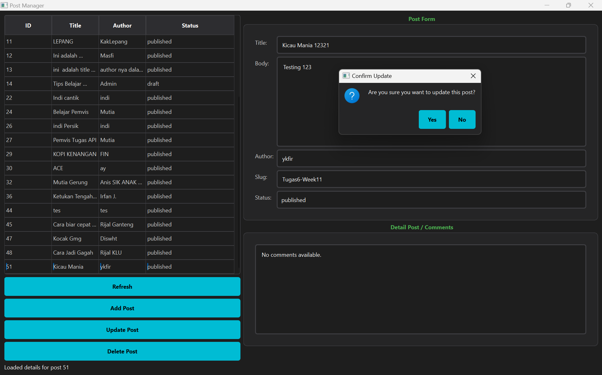
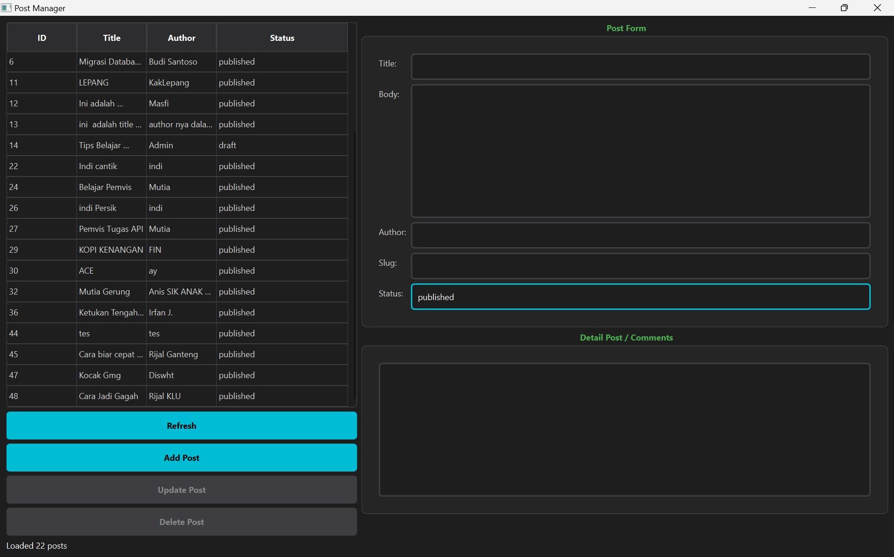
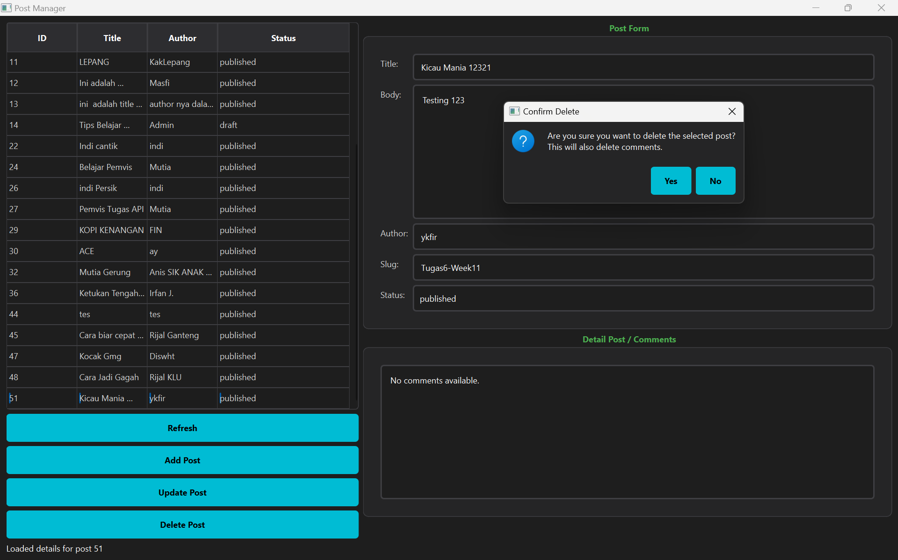

# Tugas 5 - Post Manager (Threading & REST API)

**Mata Kuliah:** Pemrograman Visual  
**Nama:** RIFKY AKBAR UTOMO PUTRA  
**NIM:** F1D02310149  
**Kelas:** D  

---

## 📌 Deskripsi Tugas
Tugas ini bertujuan untuk membangun sebuah aplikasi desktop **Post Manager** berbasis antarmuka grafis (GUI) menggunakan *framework* **PySide6**. Aplikasi ini bertindak sebagai *client* yang terhubung secara langsung ke layanan *REST API* publik (`https://api.pahrul.my.id/api/posts`) untuk mengelola data artikel/postingan. 

Tantangan utama dalam tugas ini adalah penerapan **Multi-threading** (`QRunnable` dan `QThreadPool`). Dengan *threading*, seluruh proses pengambilan dan pengiriman data melalui internet (network request) dieksekusi di *background*, sehingga antarmuka aplikasi (UI) tetap mulus dan tidak mengalami *freeze* (macet) saat menunggu balasan dari server. Selain itu, aplikasi juga didesain menggunakan gaya eksternal `style.qss` untuk menghasilkan tampilan mode gelap (*Dark Mode*) yang modern.

---

## 📸 Penjelasan Fitur & Dokumentasi Pengujian

Aplikasi ini telah memenuhi standar operasi CRUD (Create, Read, Update, Delete) melalui 4 metode HTTP (*GET, POST, PUT, DELETE*). Berikut adalah rincian fungsionalitas beserta hasil pengujiannya:

### 1. Tampilan Awal & Memuat Daftar Data (Method: GET)
Saat aplikasi pertama kali dijalankan, sistem secara otomatis melakukan permintaan `GET` ke *endpoint* API untuk menarik seluruh daftar postingan. Selama proses penarikan, tombol akan dinonaktifkan sementara dan muncul status *Loading*. Setelah data diterima, tabel akan terisi rapi dengan informasi ID, Judul, Penulis, dan Status.


### 2. Membaca Detail Postingan & Komentar (Method: GET by ID)
Ketika pengguna mengklik salah satu baris pada tabel, aplikasi merespons dengan memanggil *endpoint* spesifik (`/api/posts/{id}`). Data yang dikembalikan tidak hanya mengisi form di sebelah kanan untuk keperluan *edit*, tetapi juga menarik seluruh komentar netizen terkait postingan tersebut dan menampilkannya dalam mode *Read-Only* di kotak "Detail Post / Comments".


### 3. Menambah Postingan Baru (Method: POST)
Pengguna dapat menambahkan data postingan baru dengan mengisi form (*Title, Body, Author, Slug, Status*). Kolom *Slug* diatur agar harus unik. Saat tombol **Add Post** ditekan, aplikasi tidak langsung mengirim data, melainkan memunculkan kotak dialog keamanan untuk meminta konfirmasi pengguna.



### 4. Memperbarui Postingan (Method: PUT)
Untuk mengubah data, pengguna memilih baris pada tabel, kemudian memodifikasi isian pada form di sebelah kanan. Setelah penyesuaian selesai, pengguna mengklik tombol **Update Post**. Sama seperti proses penambahan, sistem akan memastikan tindakan ini melalui pop-up konfirmasi sebelum mengirim instruksi pembaruan ke server menggunakan metode `PUT`.



### 5. Menghapus Postingan (Method: DELETE)
Sesuai dengan ketentuan tugas, penghapusan data bersifat *cascade* (menghapus postingan sekaligus komentar di dalamnya). Oleh karena itu, ketika pengguna memilih data dan menekan tombol **Delete Post**, aplikasi diwajibkan menampilkan dialog konfirmasi peringatan. Jika dikonfirmasi, sistem akan mengeksekusi metode `DELETE` ke server dan me-*refresh* tabel secara otomatis.



---

## 🚀 Cara Menjalankan Aplikasi (Instalasi)

Ikuti langkah-langkah berikut untuk mencoba aplikasi ini secara lokal:

1. Buka Terminal / Command Prompt pada *folder project* ini.
2. (Opsional namun disarankan) Buat dan aktifkan *Virtual Environment*:
   ```bash
   python -m venv venv
   # Windows:
   venv\Scripts\activate
   # Linux/Mac:
   source venv/bin/activate